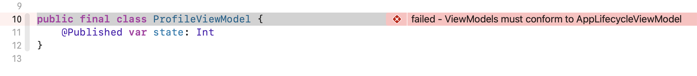

# 🧩 Harmonize

Harmonize is a Swift project with linting powers, allowing developers to easily assert, validate and harmonize code structure and architecture with declarative tests, enforcing best practices to ensure clean, maintained and unified code aligned with your project guidelines.

Harmonize lint rules are written in the form of unit tests, using using [XCTest](https://developer.apple.com/documentation/xctest/) or [Quick](https://github.com/Quick/Quick).

> [!WARNING]  
> Harmonize is still being build in public and is being used internally. We consider it is still a early alpha version and its API is subject to change.

## Installation

To Harmonize to be able to query your project files and provides the semantics API to your tests, you need to create a `.harmonize.yaml` config file at the root level of your project.

> [!NOTE]  
> We'll a build a CLI that will do this automatically for you, but for this alpha version this is a mandatory step.

```YAML
excludes:
  - Package.swift
```
### SPM

```swift
// Product Dependencies block
.package(url: "https://github.com/perrystreetsoftware/harmonize.swift.git", branch: "main")

// Target dependencies block
.product(name: "Harmonize", package: "Harmonize.swift")
```

We recommend importing `Harmonize` as part of your test target. While Harmonize can be used on any Swift Package that you have, you can also create a separate Swift Package for Harmonize Rules so you don't need to couple it with your code.

### Config file

We support a `.harmonize.yaml` config file, and it is also mandatory to exist to Harmonize to work property. The only support config for now is the `excludes` that allows you to opt-out files or folders from your project.

## Usage

Harmonize is simple as writing a unit test.

```swift
import XCTest
import Harmonize

final class ViewModelsTests: XCTestCase {
    func testViewModelsBaseViewModelConformance() throws {
        Harmonize.on("ViewModels").classes()
            .assertTrue(message: "ViewModels must conform to AppLifecycleViewModel") {
                $0.conforms(to: AppLifecycleViewModel.self)
            }
    }
}
```



## Contributing

Anyone can contribute to this project with Pull Requests, issues, or feedback you find relevant. We are yet to build the code of conduct tho.

## Considerations

This project is highly inspired by [SwiftLint](https://github.com/realm/SwiftLint/tree/main) and [Konsist](https://github.com/LemonAppDev/konsist) (A Kotlin project and where this idea initially came from).

We consider this project as being a companion to your preferred compile-time linter as you can write your custom lint rules to spread your team and project architectural alignments using unit tests.

Our Semantics module is built using [Swift Syntax](https://github.com/swiftlang/swift-syntax) to parse the language Abstract Syntax Tree (AST) is inspired by the now archived [SwiftDocc Semantics](https://github.com/swiftlang/swift-docc).

> [!NOTE]  
> We are also aware of potential performance problems when querying big codebases and parsing the AST. We're still working to improve this and make Harmonize faster.